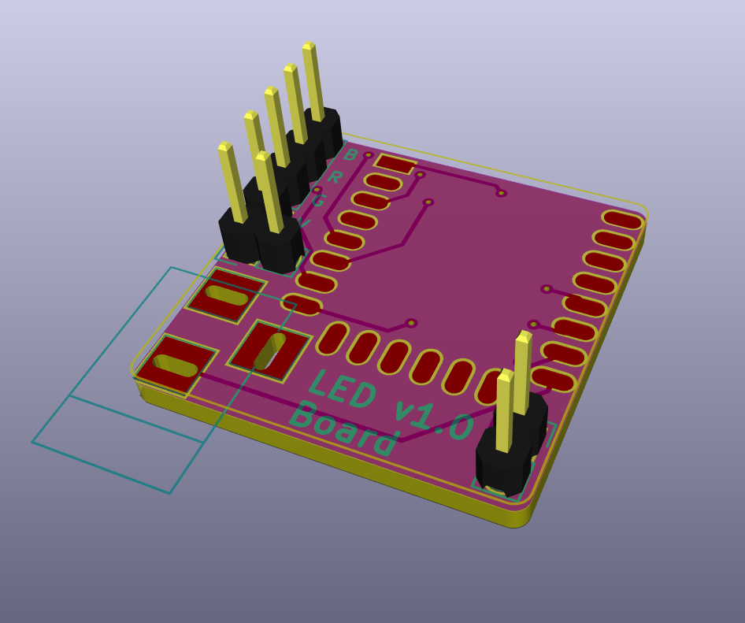

Gameleds
========

[](https://gitlab.com/skorokithakis/gamelights/commits/master)



Gameleds is a WiFi-enabled RGB LED strip controller. It's meant to drive my 12V
5050 LEDs, but can work with any voltage LEDs, as long as their connectors are
Vcc, R, G, B (like mine).

This controller can currently be controlled through MQTT and UDP (with
autodiscovery). Pull requests are welcome.


The PCB
-------

You can buy [the full, paneled
PCB](http://dirtypcbs.com/view.php?share=16892&accesskey=996a11f93e9b6f833112ceedd77168f7)
from DirtyPCBs. You will need:

* An ESP8266 12E or 12F.
* 6 10k 0804 SMD resistors.
* 1 1μF 0804 SMD capacitor.
* A barrel connector.
* LED strip connectors, the ones with the cables and stuff.
* 3 3401 N-MOSFETS.
* 1 SPX3819 3.3V LDO.
* One of those little voltage converter thingy boards, to get your 12V down to
  5V.

Solder all that on the PCB, and you have your very own WiFi-enabled LED
controller!


Building the code
-----------------

To build the code, just install [PlatformIO](http://platformio.org/) and type:

```
platformio run -t upload
```

Or, to populate all your secret variables without committing them, use the
`build.sh.example` script I have included. Just rename it to `build.sh`, put
your secret keys in and run it.


Other stuff
-----------

Since many of my friends have gone apeshit over having lights pulse and follow
and do crazy stuff with their games, I may make a product out of this and sell
a complete solution. Let me know if you want me to Kickstart this.

Stavros
